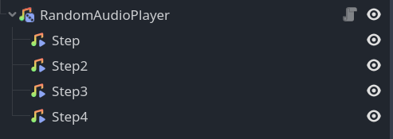

# RandomAudioPlayer
A simple node that selects a random child and plays the audio

# 🧪 Installation

1. [Download for Godot 4.x](https://github.com/gdplugs/RandomAudioPlayer/archive/refs/heads/main.zip)
2. Unpack the `random_audio_player` folder into your `/addons` folder within the Godot project
3. Enable this addon within the Godot settings: `Project > Project Settings > Plugins`

# 📚 Getting started

